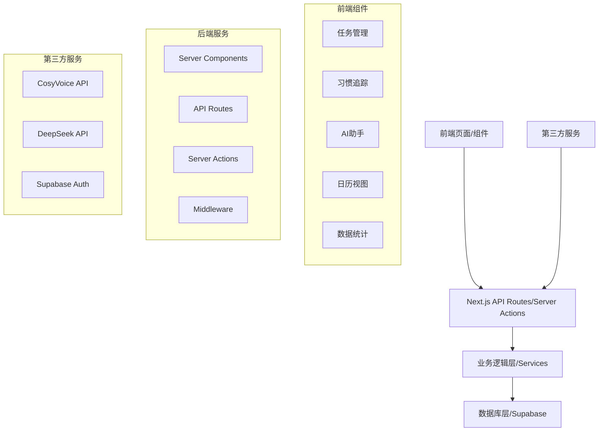
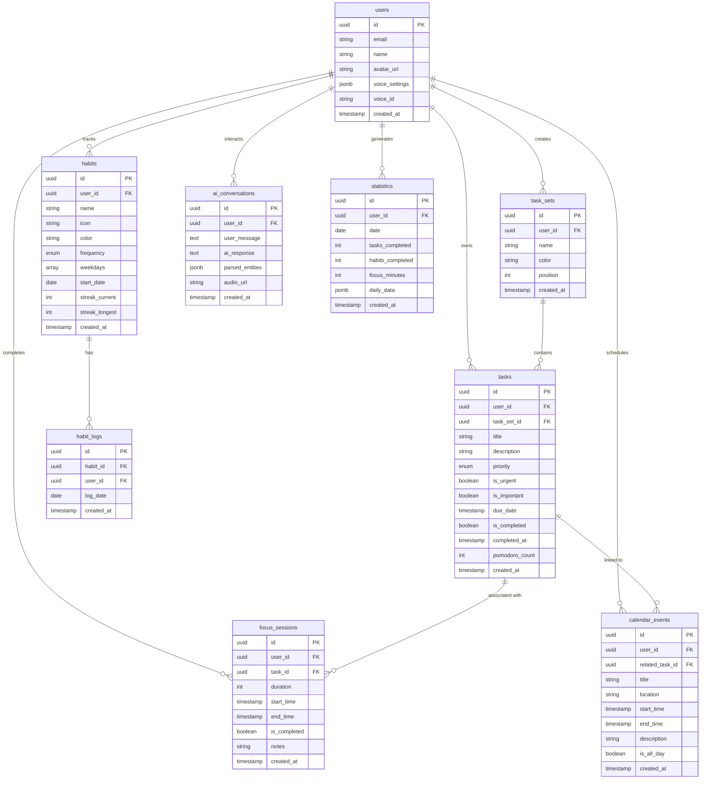
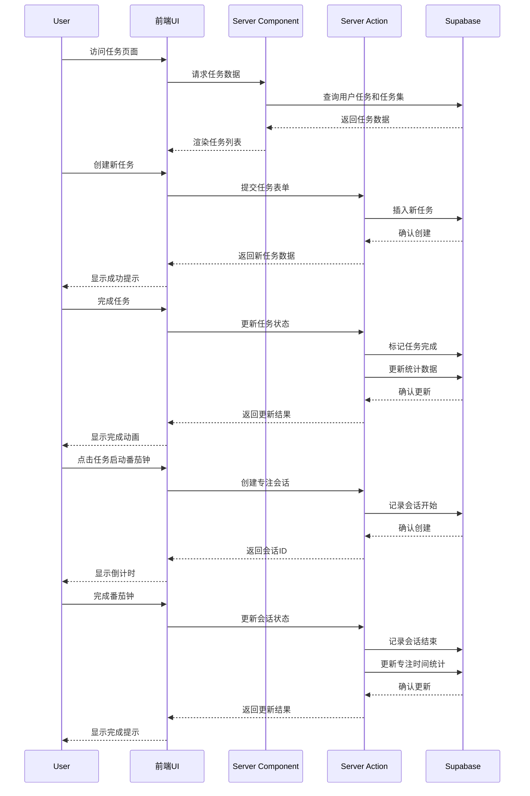
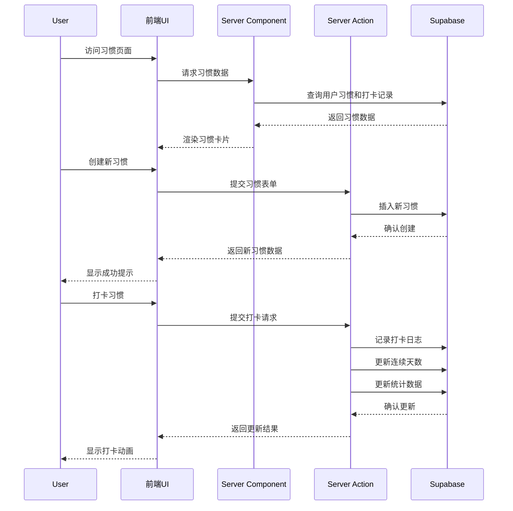
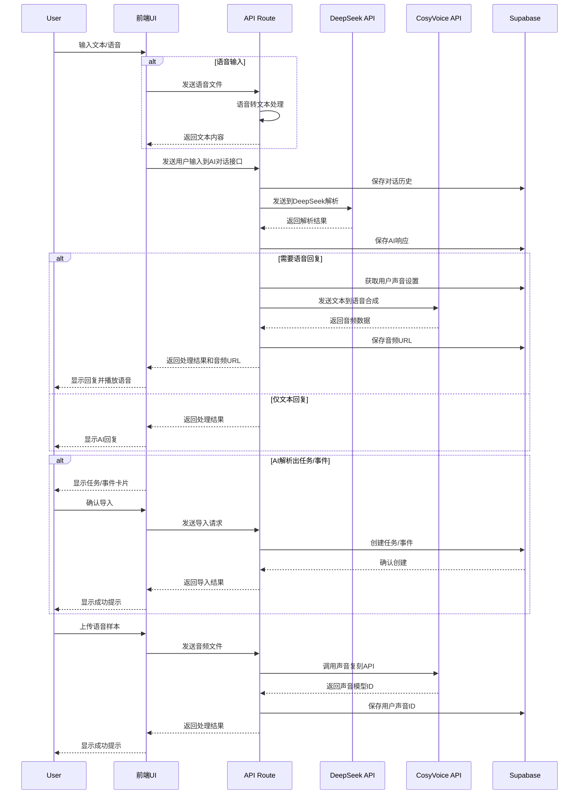
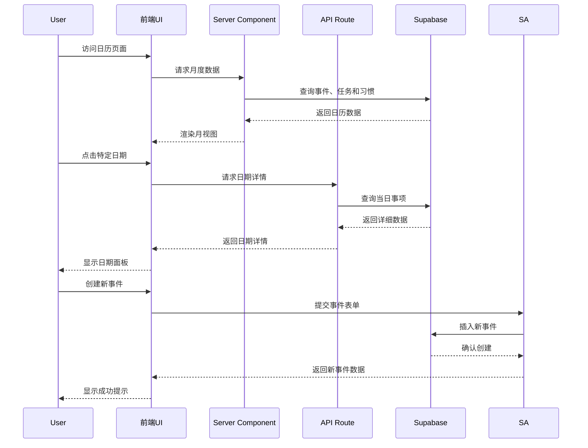
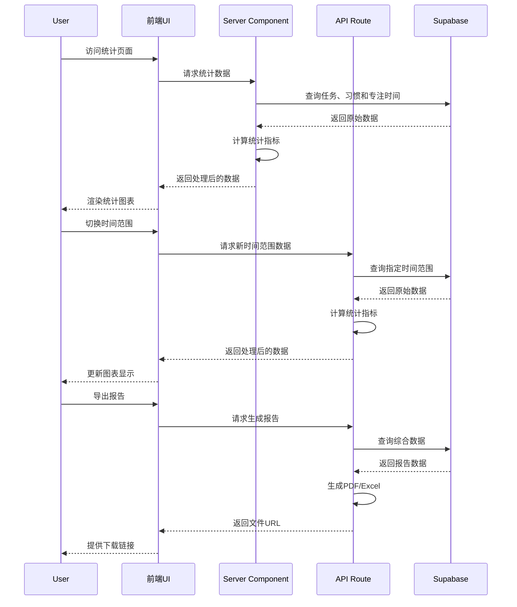

# SuperTimer 应用系统设计与架构（整合版）

基于产品原型和技术需求，我整合了一个完整的系统设计方案，专注于 Next.js 框架下的实现，并整合了 AI 语音和对话功能。

## 系统整体架构



Next.js 的全栈特性使我们能够在同一代码库中处理前端渲染和后端逻辑，通过 Server Components、API Routes 和 Server Actions 实现无缝集成。

## 核心数据模型

基于产品需求，我们设计以下核心数据模型：



## API 路由设计

Next.js App Router 架构下的 API 路由设计：

```
app/
├── api/
│   ├── tasks/
│   │   ├── route.ts                # GET, POST 任务列表
│   │   ├── [id]/
│   │   │   ├── route.ts            # GET, PUT, DELETE 单个任务
│   │   │   └── complete/
│   │   │       └── route.ts        # POST 完成任务
│   │   ├── sets/
│   │   │   ├── route.ts            # GET, POST 任务集
│   │   │   └── [id]/
│   │   │       └── route.ts        # GET, PUT, DELETE 单个任务集
│   │   └── pomodoro/
│   │       ├── start/
│   │       │   └── route.ts        # POST 开始番茄钟
│   │       └── complete/
│   │           └── route.ts        # POST 完成番茄钟
│   │
│   ├── habits/
│   │   ├── route.ts                # GET, POST 习惯列表
│   │   ├── [id]/
│   │   │   ├── route.ts            # GET, PUT, DELETE 单个习惯
│   │   │   └── log/
│   │   │       └── route.ts        # POST 习惯打卡
│   │   └── stats/
│   │       └── route.ts            # GET 习惯统计
│   │
│   ├── ai/
│   │   ├── chat/
│   │   │   └── route.ts            # POST AI对话(DeepSeek)
│   │   ├── voice/
│   │   │   ├── clone/
│   │   │   │   └── route.ts        # POST 声音复刻(CosyVoice)
│   │   │   ├── synthesize/
│   │   │   │   └── route.ts        # POST 文本转语音
│   │   │   └── transcribe/
│   │   │       └── route.ts        # POST 语音转文本
│   │   └── import/
│   │       ├── task/
│   │       │   └── route.ts        # POST 导入AI解析的任务
│   │       └── event/
│   │           └── route.ts        # POST 导入AI解析的事件
│   │
│   ├── calendar/
│   │   ├── route.ts                # GET, POST 日历事件
│   │   ├── [id]/
│   │   │   └── route.ts            # GET, PUT, DELETE 单个事件
│   │   └── day/
│   │       └── [date]/
│   │           └── route.ts        # GET 特定日期事件
│   │
│   └── stats/
│       ├── daily/
│       │   └── route.ts            # GET 每日统计
│       ├── weekly/
│       │   └── route.ts            # GET 每周统计
│       ├── monthly/
│       │   └── route.ts            # GET 每月统计
│       └── export/
│           └── route.ts            # GET 导出报告
```

## 服务器操作 (Server Actions)

除了 API 路由外，我们还可以使用 Server Actions 处理表单提交和数据修改：

```
app/
├── actions/
│   ├── tasks.ts                    # 任务相关操作
│   ├── habits.ts                   # 习惯相关操作
│   ├── ai-assistant.ts             # AI助手相关操作
│   ├── calendar.ts                 # 日历相关操作
│   └── stats.ts                    # 统计相关操作
```

## 模块功能与后端交互流程

### 1. 任务管理模块



### 2. 习惯追踪模块



### 3. AI 秘书模块（整合 DeepSeek 和 CosyVoice）



### 4. 日历模块



### 5. 统计模块



## 技术实现细节

### 1. 前端技术栈

- **框架**: Next.js 14 (App Router)
- **样式**: TailwindCSS + shadcn/ui 组件库
- **状态管理**: React Context + SWR/React Query
- **动画**: Framer Motion
- **图表**: Chart.js / D3.js
- **表单处理**: React Hook Form + Zod
- **音频处理**: Web Audio API + MediaRecorder API

### 2. 后端技术栈

- **服务器框架**: Next.js API Routes + Server Actions
- **数据库**: Supabase (PostgreSQL)
- **认证**: Supabase Auth
- **ORM**: Prisma (可选)
- **AI 服务**: DeepSeek API (ep-20250423153519-vvml5 模型)
- **语音服务**: CosyVoice API (cosyvoice-v1 模型)
- **文件存储**: Supabase Storage

### 3. AI 集成实现

#### DeepSeek 集成

```typescript
// app/api/ai/chat/route.ts
import { NextRequest, NextResponse } from "next/server";
import { createClient } from "@/utils/supabase/server";

const ARK_API_KEY = process.env.ARK_API_KEY;
const DEEPSEEK_ENDPOINT = "https://ark.cn-beijing.volces.com/api/v3/chat/completions";
const MODEL_ID = "ep-20250423153519-vvml5";

export async function POST(request: NextRequest) {
  const supabase = await createClient();
  const { data: { user } } = await supabase.auth.getUser();
  
  if (!user) {
    return NextResponse.json({ error: "未授权" }, { status: 401 });
  }
  
  const { message } = await request.json();
  
  try {
    // 保存用户消息
    const { data: conversationData } = await supabase
      .from("ai_conversations")
      .insert({
        user_id: user.id,
        user_message: message,
        created_at: new Date().toISOString()
      })
      .select()
      .single();
      
    // 调用DeepSeek API
    const response = await fetch(DEEPSEEK_ENDPOINT, {
      method: "POST",
      headers: {
        "Content-Type": "application/json",
        "Authorization": `Bearer ${ARK_API_KEY}`
      },
      body: JSON.stringify({
        model: MODEL_ID,
        messages: [
          { role: "system", content: "你是SuperTimer应用的AI助手，可以帮助用户管理任务和习惯。" },
          { role: "user", content: message }
        ],
        tools: [
          {
            type: "function",
            function: {
              name: "create_task",
              description: "创建一个新任务",
              parameters: {
                type: "object",
                properties: {
                  title: { type: "string", description: "任务标题" },
                  description: { type: "string", description: "任务描述" },
                  priority: { type: "string", enum: ["high", "medium", "low"], description: "任务优先级" },
                  due_date: { type: "string", format: "date-time", description: "截止日期" },
                  is_urgent: { type: "boolean", description: "是否紧急" },
                  is_important: { type: "boolean", description: "是否重要" }
                },
                required: ["title"]
              }
            }
          }
        ]
      })
    });
    
    const aiResponse = await response.json();
    
    // 更新对话记录
    await supabase
      .from("ai_conversations")
      .update({
        ai_response: aiResponse.choices[0].message.content,
        parsed_entities: aiResponse.choices[0].message.tool_calls || null
      })
      .eq("id", conversationData.id);
      
    return NextResponse.json({ 
      response: aiResponse.choices[0].message,
      conversation_id: conversationData.id
    });
  } catch (error) {
    console.error("AI处理错误:", error);
    return NextResponse.json({ error: "AI处理失败" }, { status: 500 });
  }
}
```

#### CosyVoice 集成

```typescript
// app/api/ai/voice/clone/route.ts
import { NextRequest, NextResponse } from "next/server";
import { createClient } from "@/utils/supabase/server";
import { VoiceEnrollmentService } from "dashscope";

const DASHSCOPE_API_KEY = process.env.DASHSCOPE_API_KEY;

export async function POST(request: NextRequest) {
  const supabase = await createClient();
  const { data: { user } } = await supabase.auth.getUser();
  
  if (!user) {
    return NextResponse.json({ error: "未授权" }, { status: 401 });
  }
  
  try {
    const formData = await request.formData();
    const audioFile = formData.get("audio") as File;
    
    if (!audioFile) {
      return NextResponse.json({ error: "未提供音频文件" }, { status: 400 });
    }
    
    // 上传音频到Supabase Storage
    const { data: uploadData, error: uploadError } = await supabase
      .storage
      .from("voice-samples")
      .upload(`${user.id}/${Date.now()}.wav`, audioFile);
      
    if (uploadError) {
      throw new Error(`上传失败: ${uploadError.message}`);
    }
    
    // 获取公共URL
    const { data: { publicUrl } } = supabase
      .storage
      .from("voice-samples")
      .getPublicUrl(uploadData.path);
      
    // 调用CosyVoice API克隆声音
    const service = new VoiceEnrollmentService({
      apiKey: DASHSCOPE_API_KEY
    });
    
    const prefix = `user${user.id.substring(0, 8)}`;
    const voiceId = await service.createVoice("cosyvoice-v1", prefix, publicUrl);
    
    // 保存声音ID到用户配置
    await supabase
      .from("users")
      .update({
        voice_id: voiceId,
        voice_settings: {
          model: "cosyvoice-v1",
          sample_url: publicUrl,
          created_at: new Date().toISOString()
        }
      })
      .eq("id", user.id);
      
    return NextResponse.json({ 
      success: true, 
      voice_id: voiceId 
    });
  } catch (error) {
    console.error("声音复刻错误:", error);
    return NextResponse.json({ error: "声音复刻失败" }, { status: 500 });
  }
}
```

### 4. 部署与基础设施

- **托管平台**: Vercel
- **数据库托管**: Supabase
- **监控**: Vercel Analytics + Sentry
- **CI/CD**: GitHub Actions
- **音频存储**: Supabase Storage

### 5. 性能优化策略

- **静态生成与增量静态再生成 (ISR)**: 对统计页面等相对静态的内容
- **服务器组件**: 减少客户端 JavaScript 体积
- **流式渲染**: 对大型数据集的渲染
- **图片优化**: Next.js Image 组件
- **边缘函数**: 处理 AI 相关请求
- **数据预取与缓存**: SWR/React Query
- **音频处理优化**: 客户端音频压缩和流式传输

### 6. 安全考虑

- **认证**: Supabase Auth + JWT
- **授权**: 行级安全策略 (RLS)
- **API 保护**: 速率限制 + CORS
- **数据验证**: Zod 模式验证
- **敏感数据处理**: 环境变量 + 加密存储
- **AI 服务密钥保护**: 仅在服务器端使用，不暴露给客户端

## 总结

这个系统设计充分利用了 Next.js 的全栈特性，结合 Supabase 提供的数据库和认证服务，以及 DeepSeek 和 CosyVoice 的 AI 能力，为 SuperTimer 应用提供了一个可扩展、高性能的架构。通过服务器组件和服务器操作，我们可以在保持良好用户体验的同时，减少客户端 JavaScript 的体积，提高应用性能。

该设计考虑了应用的所有核心功能，包括任务管理、习惯追踪、AI 助手、日历视图和数据统计，并为每个功能模块提供了清晰的数据流和交互逻辑。同时，我们也考虑了性能优化和安全性，确保应用能够安全、高效地运行。

特别是在 AI 助手模块，我们整合了 DeepSeek 的自然语言处理能力和 CosyVoice 的声音复刻技术，为用户提供个性化的语音交互体验，使应用更加智能和人性化。