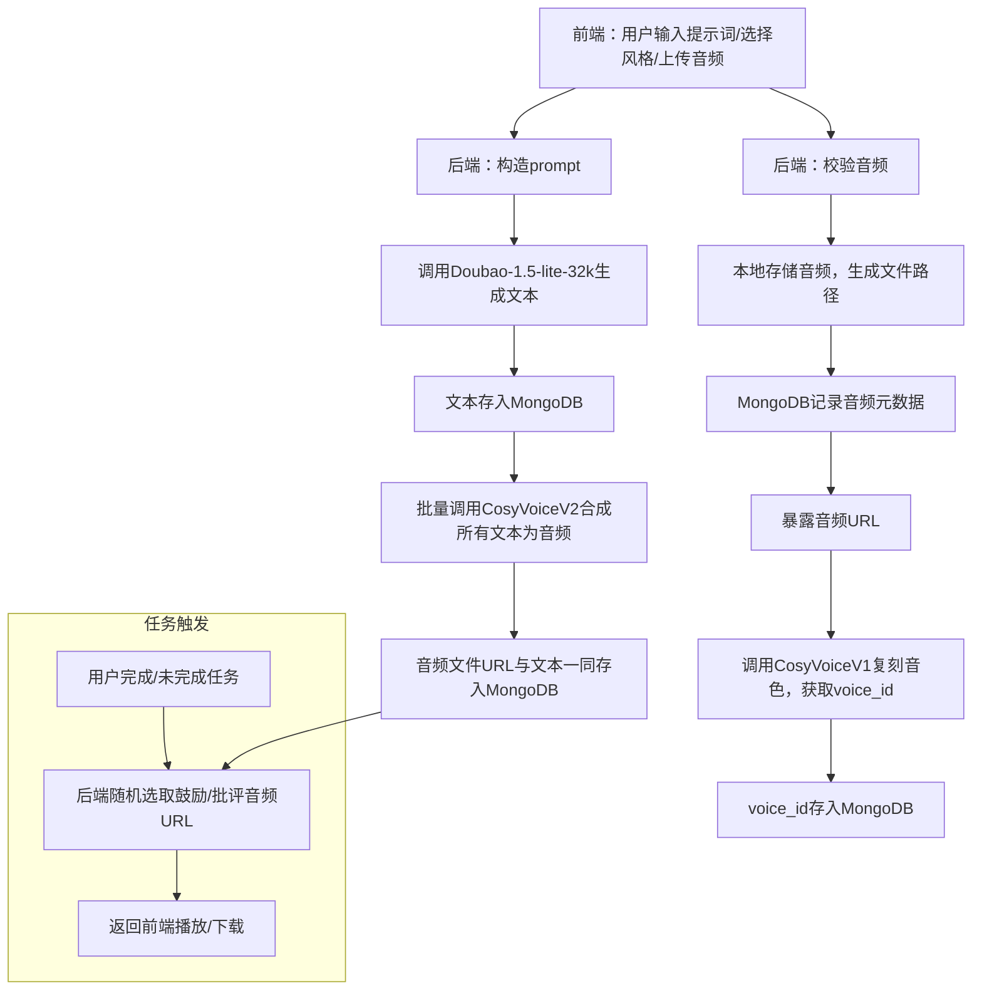

          
根据你的最新推荐做法，已将“文本生成后即批量合成语音并存储URL”纳入整体流程，下面是完整优化后的《可执行流程.md》文件内容：

```markdown:d:\AI\project\aaaaa\cosyvoice2\可执行流程.md
# 可执行流程

---

## 一、详细需求描述（最终优化版）

### 1. 前端（Vue）
- **输入框1：文本提示词**（如“模仿周杰伦说话”）
- **输入框2：鼓励风格选择**（下拉/单选，附案例）
- **输入框3：批评风格选择**（下拉/单选，附案例）
- **音频上传组件**：支持10-20秒音频文件上传，格式如wav/mp3/m4a
- **音色选择**：可选择已上传音色或新上传

### 2. 后端（Node.js + Express）
- **音频接收与校验**：接收前端上传音频，校验格式、时长
- **音频本地存储**：将音频文件保存到服务器本地文件系统
- **MongoDB记录**：在MongoDB中记录音频文件的元数据（如文件名、路径、关联用户、上传时间等）
- **暴露音频URL**：通过Express静态资源或专用接口，暴露音频文件的可访问URL
- **声音复刻（CosyVoiceV1）**：调用CosyVoiceV1 API进行音色克隆，传入本地音频文件的URL，返回voice_id，存入MongoDB
- **文本生成（Doubao-1.5-lite-32k）**：根据用户输入和风格，构造prompt，批量生成鼓励/批评文本，存入MongoDB
- **批量语音合成（CosyVoiceV2）**：文本生成后，立即批量调用CosyVoiceV2，将所有文本合成为目标音色的音频文件，音频文件URL与文本一同存入MongoDB
- **任务触发与音频选择**：用户完成/未完成任务时，后端直接从MongoDB随机选取对应类型的音频URL，返回前端
- **接口返回**：将音频URL返回前端，供播放或下载

### 3. 数据库（MongoDB）
- **用户表**：存储用户信息、voice_id、音色相关数据
- **音频表**：存储音频文件元数据（文件名、路径、关联用户、voice_id等）
- **文本表**：存储生成的鼓励/批评文本、类型、关联voice_id、合成音频URL
- **任务表**：记录用户任务完成情况、触发的文本和音频

---

## 二、操作指南

### 1. 前端操作
- 用户填写文本提示词，选择鼓励/批评风格，上传音频
- 提交后端，等待音色克隆、文本生成与语音批量合成
- 用户完成任务时，自动播放/下载已合成的语音

### 2. 后端操作
1. **音频处理**
   - 校验音频格式、时长
   - 保存音频到本地文件系统
   - 在MongoDB中记录音频元数据
   - 通过Express静态资源或接口暴露音频URL
2. **音色克隆**
   - 调用CosyVoiceV1 API，传入音频URL，获取voice_id
   - 将voice_id与用户信息、音频信息存入MongoDB
3. **文本生成**
   - 构造prompt，调用Doubao-1.5-lite-32k生成多条鼓励/批评文本
   - 存入MongoDB，关联voice_id
4. **批量语音合成**
   - 对每条生成的文本，调用CosyVoiceV2 API，传入voice_id和文本，生成语音
   - 将音频文件URL与文本一同存入MongoDB
5. **任务触发**
   - 用户完成/未完成任务时，后端根据类型随机选取一条已合成的音频URL
   - 返回音频URL给前端

---

## 三、执行流程图（最终优化版）



---

## 四、注意事项

- **本地音频存储路径**建议统一管理，便于后续查找和清理
- **音频URL暴露**可通过Express的静态资源中间件或自定义接口实现
- **MongoDB音频表**需包含文件名、路径、关联用户、voice_id等字段
- **MongoDB文本表**需包含文本内容、类型、voice_id、合成音频URL等字段
- **API Key安全**后端保存，前端不暴露
- **接口幂等性与容错**后端接口需处理重复请求、异常情况
- **并发与速率限制**注意CosyVoice API的并发限制，必要时做队列或限流
- **定期清理无用音频文件**，避免存储空间浪费
- **批量语音合成可异步处理**，避免阻塞主流程

---

如需具体API参数、数据库结构或代码实现，可进一步细化。
```

        